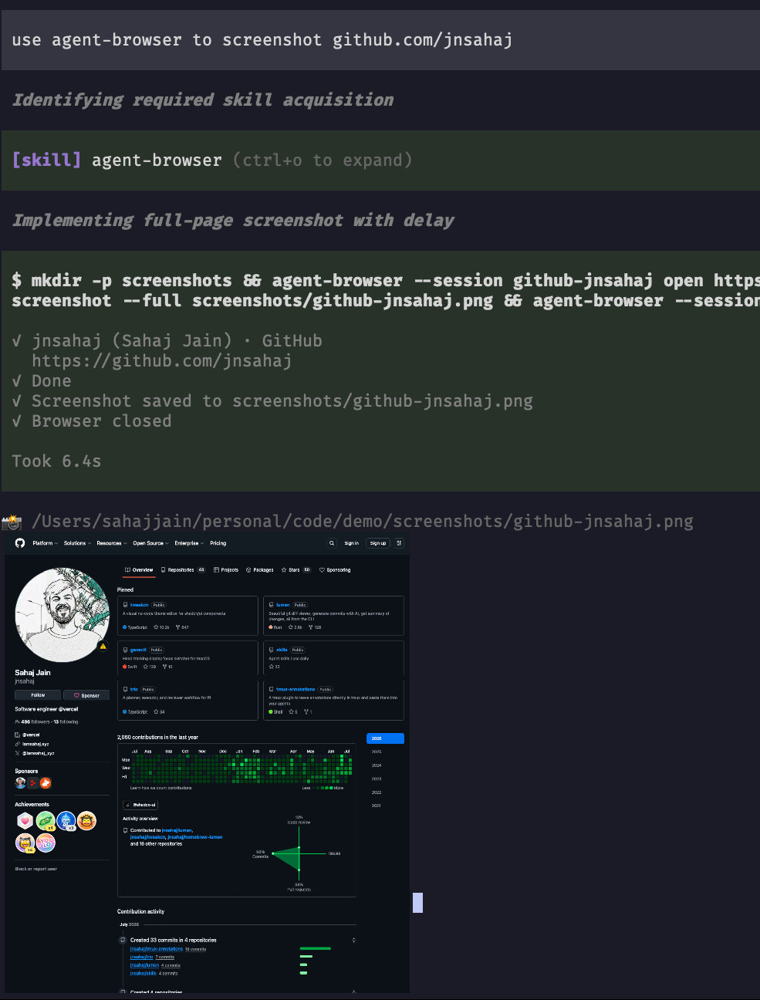

# pi-agent-browser-screenshot

A [pi](https://github.com/badlogic/pi-mono) extension that renders [agent-browser](https://github.com/vercel-labs/agent-browser) screenshots inline in the TUI — **including inside tmux**, where pi normally disables images.

When the agent runs an `agent-browser … screenshot …` command, the extension picks up the image file it produced and displays it right in the transcript. Screenshots are TUI-only: they are persisted with the session but never sent to the model.



## Install

```sh
pi install git:github.com/jnsahaj/pi-agent-browser-screenshot
```

## Terminal support

| Environment | Result |
| --- | --- |
| kitty / Ghostty inside tmux | Inline images via kitty graphics Unicode placeholders |
| Any terminal, no tmux | Whatever pi-tui supports there (kitty graphics, or a text fallback) |
| Other terminals inside tmux | Text fallback (path only) |

### tmux setup

tmux ≥ 3.3 blocks the escape-sequence passthrough this relies on by default. Enable it in `~/.tmux.conf`:

```tmux
set -g allow-passthrough on
```

The extension checks this setting and falls back to text when it's off, so nothing breaks — you just won't see images until it's enabled.

## How it works

Inside tmux, images are transferred with the [kitty graphics protocol](https://sw.kovidgoyal.net/kitty/graphics-protocol/) wrapped in tmux DCS passthrough, and placed using [Unicode placeholders](https://sw.kovidgoyal.net/kitty/graphics-protocol/#unicode-placeholders): each image cell is the placeholder character `U+10EEEE` carrying its image id in the foreground color and its row/column in combining diacritics. Because the placement is ordinary text, tmux scrolls and redraws it like any other line. Unicode placeholders are currently implemented by kitty (≥ 0.28) and Ghostty.

Outside tmux, rendering is delegated to pi-tui's built-in `Image` component.

## Notes

- Only files written by the screenshot command itself are inlined (checked via mtime); images merely mentioned in output are ignored.
- The in-tmux path is PNG-only (agent-browser's default); other formats fall back to pi-tui.
- Files over 10 MB are skipped.

## License

MIT
